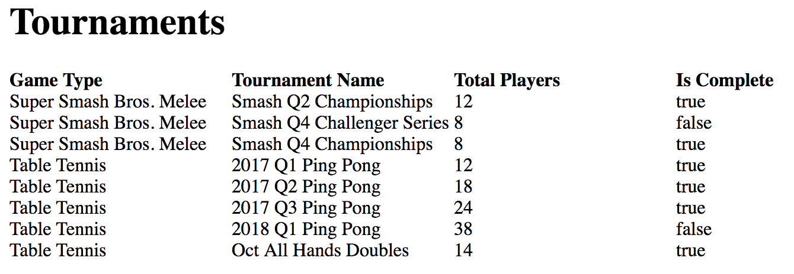

# Honey Tournament Tracker

## MVP
Lifetime standings accross all tournaments for each game type

## Future Features
 1. ELO system
 2. Updating Tournaments Through API
 3. Match Prediction System

### Dev Log

3-11
  * Initial research into existing node implementations for challonge
    * Didn't like code style / opinions of current open source stuff
  * Got basics going

3-18
  * Tournament Data is now displayed on index
  * Cleaned up the Tournament names in Challonge
    * YY QQ Event
  * Started down the participant path
    * Major issue: since noone has accounts, connecting players accross tournaments may be hard :grimacing:
  * Wrote a lot of bad code, need to clean up eventually
  * Have a rough start to the lifetime history, just need to keep chugging down path

  

3-31
  * Cleaned up ugly, ugly async code
  * Retrieving player data and organizing them by name is done
  * Players now have records and it spits out a leaderboard in console!
  * Still biggest problem looming is the ability to connect players with their opponent
    * Right now the opponents have multiple ids so finding each opponent is O(n)
    * Which means finding all matches is O(n^2) :sweat_smile:
    * Granted this is all in memory, should maybe consider starting to store data in redis
